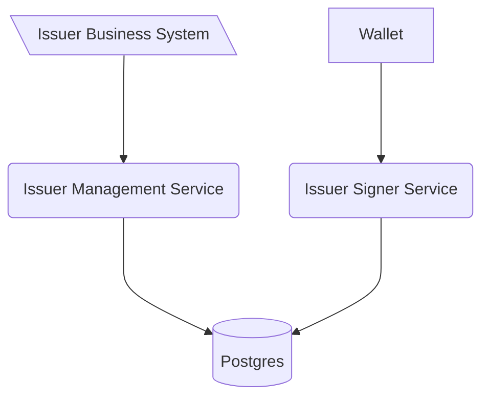

<!--
SPDX-FileCopyrightText: 2025 Swiss Confederation

SPDX-License-Identifier: MIT
-->


# Generic issuer signing service OID4VCI

This software is a web server implementing the technical standards as specified in
the [Swiss e-ID and trust infrastructure: Initial implementation](https://swiyu-admin-ch.github.io/initial-technology/).
Together with the other generic components provided, this software forms a collection of APIs allowing issuance and
verification of verifiable credentials without the need of reimplementing the standards.

The Generic Issuer Signing Service is the interface used by the wallet to collect an offered credential. It must be
reachable from the web for this purpose.

As with all the generic issuance & verification services it is expected that every issuer and verifier hosts their own
instance of the service.

The issuer management service is linked to the issuer signer services through a database, allowing to scale the signer
service independently from the management service.

## Table of Contents

- [Overview](#Overview)
- [Deployment](#deployment)
- [Development](#development)
- [Known Issues](known-issues)
- [Contributions and feedback](#contributions-and-feedback)
- [License](#license)

## Overview



# Deployment

For the deployment of the component please consult [deployment section of the issuer-agent-management](https://github.com/swiyu-admin-ch/eidch-issuer-agent-management)
because it is the main interaction point with the issuer managent/oid4vci bundle

# Development

> Please be aware that this section **focus on the development of the issuer management service**. For the deployment of the component please consult [deployment section of the issuer-agent-management](https://github.com/swiyu-admin-ch/eidch-issuer-agent-management).

## Setup

- Start application Oid4vciApplication with local profile in IDE
  - Starts docker compose for database
  - Runs Flyway migrations if needed
- Api definitions can be found [here](http://localhost:8080/swagger-ui/index.html#/)

or:
Start database with:

```shell
docker compose up --build
```

Generate SDJWT_KEY and set it as env variable:

```shell
openssl ecparam -genkey -name prime256v1 -noout -out private.pem
```

Set SDJWT_KEY Environment variable

```shell
mvn spring-boot:run -Dspring-boot.run.profiles=local
```

## Deployment Information

The database initialization with flyway will be done by the Issuer Agent Management.

## Configuration

### Generate Keys

Currently only EC 256 keys are used.
Generate private key with:
`openssl ecparam -genkey -name prime256v1 -noout -out ec_private.pem`
Remember to keep private keys private and safe. It should never be transmitted, etc.

On the base registry the public key is published. To generate the public key form the private key we can use
`openssl ec -in private.pem -pubout -out ec_public.pem`

### Configuration Environment Variables

The Generic Issuer Agent Management is configured using environment variables.

| Variable                       | Description                                                                                                                                                                      |
| ------------------------------ | -------------------------------------------------------------------------------------------------------------------------------------------------------------------------------- |
| POSTGRES_USER                  | Username to connect to the Issuer Agent Database shared with the issuer agent managment service                                                                                  |
| POSTGRES_PASSWORD              | Username to connect to the Issuer Agent Database                                                                                                                                 |
| POSTGRES_JDBC                  | JDBC Connection string to the shared DB                                                                                                                                          |
| EXTERNAL_URL                   | The URL of the Issuer Signer. This URL is used in the credential offer link sent to the Wallet                                                                                   |
| ISSUER_ID                      | DID of the Credential Issuer. This will be written to the credential and used during verification                                                                                |
| OPENID_CONFIG_FILE             | JSON file containing the OpenID Connect Configuration of the Issuer. Placeholder replacement is done as described in Config File Placeholders                                    |
| METADATA_CONFIG_FILE           | The OID4VCI Metadata as a json. Placeholder replacement is done as described in Config File Placeholders. For details on the OID4VCI Metadata consult the OID4VCI Specification. |
| SDJWT_KEY (Optional - See HSM) | The private key used to sign SD-JWT Credentials. The matching public key must be published on the base registry for verification. - Not recommended.                             |
| DID_SDJWT_VERIFICATION_METHOD  | The full DID with fragment as used to find the public key for sd-jwt VCs in the DID Document. eg: `did:tdw:<base-registry-url>:<issuer_uuid>#<sd-jwt-public-key-fragment>`       |
| JWKS_ALLOWLIST (Optional)      | A Json Web Key set of the public keys authorized to create the credential subject data.                                                                                          |
| ENABLE_VAULT                   | Enabling the kubernetes cloud vault to privide private keys to the application                                                                                                   |
| MONITORING_BASIC_AUTH_ENABLED  | Enables basic auth protection of the /actuator/prometheus endpoint. (Default: false)                                                                                             |
| MONITORING_BASIC_AUTH_USERNAME | Sets the username for the basic auth protection of the /actuator/prometheus endpoint.                                                                                            |
| MONITORING_BASIC_AUTH_PASSWORD | Sets the password for the basic auth protection of the /actuator/prometheus endpoint.                                                                                            |

### Config File Templating

The content of the metadata json files, among these METADATA_CONFIG_FILE and OPENID_CONFIG_FILE can be annotated with
template values.
By default the external-url can be always used.

```
{
  "issuer": "${external-url}",
  "token_endpoint": "${external-url}/token"
}
```

Using Spring environment variables arbitrary environment variables can be used for the templating.

Let's say we want to add a prefix to the display name for your VC depending on the environment your issuer runs on.
This can be achieved by adding in a template value, which is in essence an arbitrary string decorated by ${}.
In this case we choose "stage". The environment variables are all in caps.
See
the [official Spring documentation](https://docs.spring.io/spring-boot/docs/2.6.1/reference/html/features.html#features.external-config.typesafe-configuration-properties.relaxed-binding.environment-variables)
for further information.

```
...
      "display": [
        {
          "name": "${stage}MyCredential",
...
```

In our deployment we can set the value by adding in the environment variable
`APPLICATION_TEMPLATEREPLACEMENT_STAGE=dev-`

### Allowed config values
> The paths specified below are referring to the json structure of the credential issuer metadata as specified in the [OpenID4VP sepcificiation](https://openid.net/specs/openid-4-verifiable-credential-issuance-1_0-ID1.html#section-11.2.3)
> 
| Config path                                                                   | Allowed values                                               | Required | Comment                                                   |
|-------------------------------------------------------------------------------|--------------------------------------------------------------|----------|-----------------------------------------------------------|
| credential_response_encryption.alg_values_supported                           | ["RSA-OAEP-256","ECDH-ES+A128KW"]                            | Yes      |                                                           |
| credential_response_encryption.enc_values_supported                           | ["A128CBC-HS256"]                                            | Yes      |                                                           |
| version                                                                       | "1.0"                                                        | Yes      |                                                           |
| credential_configurations_supported.*.format                                  | "vc+sd-jwt"                                                  | Yes      |                                                           |
| credential_configurations_supported.*.credential_signing_alg_values_supported | ["ES256"]                                                    | Yes      |                                                           |
| credential_configurations_supported.*.proof_types_supported                   | ``` "jwt": {"proof_signing_alg_values_supported": ["ES256"]} ``` | No       | When set only the exact object shown as sample is allowed |
| credential_configurations_supported.*.cryptographic_binding_methods_supported | ["did:jwk"]                                                  | No       |                                                           |
### Kubernetes Vault Keys

| Variable             | Description                                                                                     |
| -------------------- | ----------------------------------------------------------------------------------------------- |
| secret.db.username   | Username to connect to the Issuer Agent Database shared with the issuer agent managment service |
| secret.db.password   | Username to connect to the Issuer Agent Database                                                |
| secret.key.sdjwt.key | Private Key used to sign jwt_vc / SD-JWT Verifiable Credentials                                 |

### HSM - Hardware Security Module

For operations with an HSM, the keys need not be mounted directly into the environment running this application.
Instead, a connection is created to the HSM via JCA. This can be with
the [Sun PKCS11 provider](https://docs.oracle.com/en/java/javase/22/security/pkcs11-reference-guide1.html) or a vendor
specific option.
Note that for creating the keys it is expected that the public key is provided as self-signed certificated.

| Variable                      | Description                                                                                                                                                                                |
| ----------------------------- | ------------------------------------------------------------------------------------------------------------------------------------------------------------------------------------------ |
| SIGNING_KEY_MANAGEMENT_METHOD | This variable serves as selector. `key` is used for a mounted key. `pkcs11` for the sun pkcs11 selector. For vendor specific libraries the project must be compiled with these configured. |
| HSM_HOST                      | URI of the HSM Host or Proxy to be connected to                                                                                                                                            |
| HSM_PORT                      |                                                                                                                                                                                            |
| HSM_USER                      | User for logging in on the host                                                                                                                                                            |
| HSM_PASSWORD                  | Password for logging in to the HSM                                                                                                                                                         |
| HSM_PROXY_USER                |                                                                                                                                                                                            |
| HSM_PROXY_PASSWORD            |                                                                                                                                                                                            |
| HSM_USER_PIN                  | For some proprietary providers required pin                                                                                                                                                |
| HSM_KEY_ID                    | Key identifier or alias, or label when using pkcs11-tool                                                                                                                                   |
| HSM_KEY_PIN                   | Optional pin to unlock the key                                                                                                                                                             |
| HSM_CONFIG_PATH               | File Path to the HSM config file when using [Sun PKCS11 provider](https://docs.oracle.com/en/java/javase/22/security/pkcs11-reference-guide1.html)                                         |
| HSM_USER_PIN                  | PIN for getting keys from the HSM                                                                                                                                                          |

### Metadata provisioning

In some simpler deployments no content delivery network is available to provide credential metadata for things like
vct (verifiable credential type), json schemas or overlays capture architecture. In this case the desired files can be
mounted in similar fashion to the issuer metadata.
A significant difference is though that the file locations are specified ad-hoc with spring environment variables as
documented in [Config File Templating](#config-file-templating)

Placeholders in these files will be replaced as well.

| Variable Map                                          | Destination                |
|-------------------------------------------------------|----------------------------|
| APPLICATION_VCTMETADATAFILES_                         | $EXTERNAL_URL/vct/         |
| APPLICATION_JSONSCHEMAMETADATAFILES_                  | $EXTERNAL_URL/json-schema/ |
| APPLICATION_OVERLAYSCAPTUREARCHITECTUREMETADATAFILES_ | $EXTERNAL_URL/oca/         |

For example we could use the file `/cfg-files/vct-test.json` by setting
`APPLICATION_VCTMETADATAFILES_TESTV1=file:/cfg-files/vct-test.json`.
The content of vct-test.json will then be available at `$EXTERNAL_URL/vct/testv1`

### JWT Based Authentication

If there is the need to ensure the data integrity of the offered credential subject data, it is possible to write the
credential subject data in the offer as JWT with the additional json property `"data_integrity": "jwt"`

    JWKS_ALLOWLIST={"keys":[{"kty":"EC","crv":"P-256","kid":"testkey","x":"_gHQsZT-CB_KvIfpvJsDxVSXkuwRJsuof-oMihcupQU","y":"71y_zEPAglUXBghaBxypTAzlNx57KNY9lv8LTbPkmZA"}]}

Note that faulty data integrity will only be checked on redemption of the credential offer. If the data integrity check
fails the credential will NOT be issued.

## Known Issues

The swiyu Public Beta Trust Infrastructure was deliberately released at an early stage to enable future ecosystem participants. There may still be minor bugs or security vulnerabilities in the test system. We will publish them in the near future as ‘KnownIssues’ in this repository.

## Contributions and feedback

The code for this repository is developed privately and will be released after each sprint. The published code can
therefore only be a snapshot of the current development and not a thoroughly tested version. However, we welcome any
feedback on the code regarding both the implementation and security aspects. Please follow the guidelines for
contributing found in [CONTRIBUTING.md](/CONTRIBUTING.md).

## License

This project is licensed under the terms of the MIT license. See the [LICENSE](/LICENSE) file for details.
